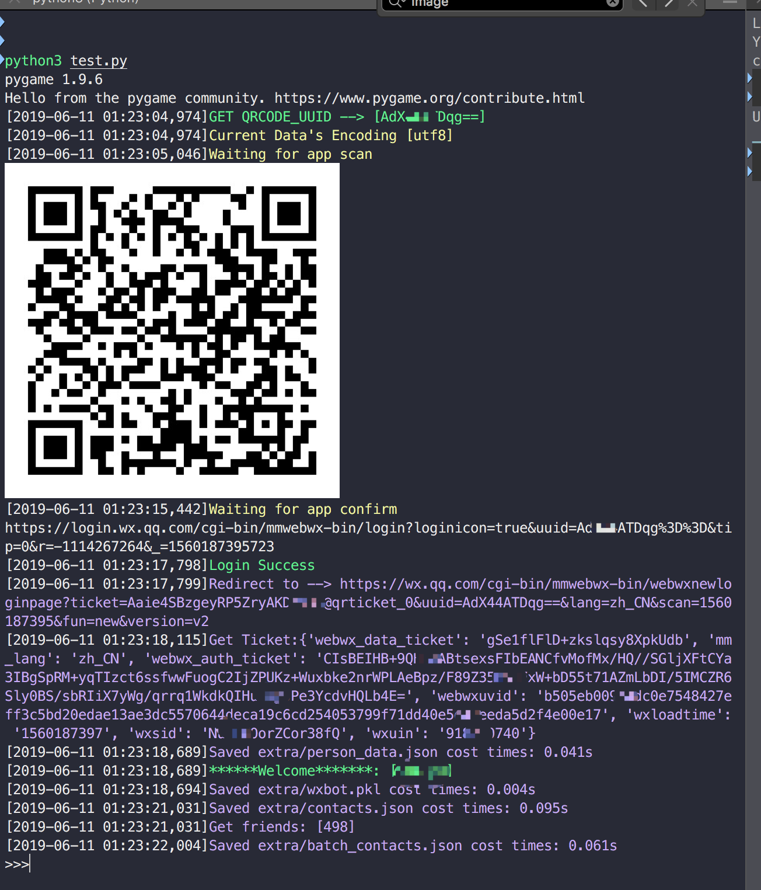

# Webot  

这是一个基于web微信协议的简易微信机器人，目前功能比较简陋且不堪🙈。

# 现有功能

-  简单文字消息回复
-  消息过滤
-  实时信息展示(带斗图表情)
-  语音消息自动播报及保存
-  通讯录导出

# 环境安装

```sh
python3 -m pip install -r requirements.txt
```

# 案例用法
下面是一个简单的文本回复案例即```test.py```

```python
from webot.core import Webot
from webot.util import Device
from pprint import pprint


class bot(Webot):
    @Device.filters(["text"], is_me=True)
    def send_back(self, msg):
        pprint(msg)
        if msg["type"] == "text":
            if "你好" == msg["content"]:
                self.send_text(msg["from"], "你好呀！")


bot().run(True, False)
```
以下是运行开始的截图!



# 消息格式

-  `from`为发送者ID
-  `to`为接受者ID

```python
{
	"content": "你好",
	"from": "@1798bad2f5dc126a19450ef2c86aa8e3",
 	"from_nick": "zhangsan",
	"is_group": False,
	"is_me": True,
	"raw_content": "你好",
	"time": 1560230438,
	"to": "@8ef49591902e6c6642732eb7289a5619456u98965f6ea32fa671fe3ab33a002f",
	"to_nick": "filehelper",
	"type": "text"
}

```

# TODO

-  文件及图片发送
-  其他更多思考中的功能